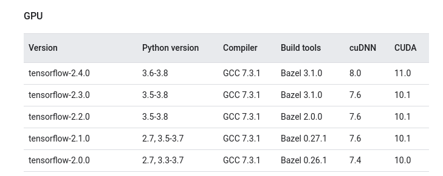
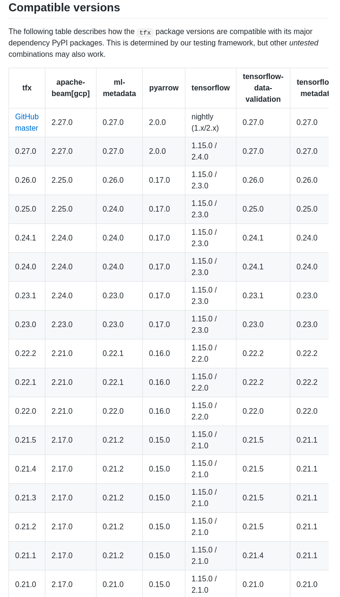

### Tensorflow/TFX/Kubeflow-pl Build Container

Assumes:
- you are running this container on a machine that has an NVIDIA GPU
- the machine has the usual NVIDIA GPU drivers installed
- the machine has docker installed
- the machine has the [NVIDIA Container Toolkit](https://github.com/NVIDIA/nvidia-docker) installed

[TF Source Build Notes](https://www.tensorflow.org/install/source#build_the_package)

[TFX Sources Notes](https://github.com/tensorflow/tfx)

[NVIDIA Drivers](https://www.nvidia.com/en-us/drivers/unix/): Driver Version: 460.39

[CUDA Toolkit](https://developer.nvidia.com/cuda-toolkit)

[driver compat](https://docs.nvidia.com/cuda/cuda-toolkit-release-notes/index.html#cuda-major-component-versions)

Example (for my Blade laptop):

NVIDIA Driver Version: 460.39

Tensorflow 2.4.1 
	- CUDA 11.0
	- cuDNN 8

CUDA closest match to 11.0 was:

	sudo sh cuda_11.0.3_450.51.06_linux.run

TIP: can always install the latest NVidia driver - it is backward compatible with CUDA versions

TIP: get proper CUDA version (ignore nvidia-smi):
	
	sudo nvcc --version

[cuDNN](https://developer.nvidia.com/rdp/cudnn-download)

[cuDNN archive](https://developer.nvidia.com/rdp/cudnn-archive)

	sudo dpkg -i libcudnn8_8.0.5.39-1+cuda11.0_amd64.deb  
	sudo dpkg -i libcudnn8-dev_8.0.5.39-1+cuda11.0_amd64.deb    (for ubu20.04)

or

	libcudnn8_8.0.4.30-1+cuda11.0_amd64.deb
	libcudnn8-dev_8.0.4.30-1+cuda11.0_amd64.deb    		    (for ubu18.04)

Edit Dockerfile for any other customizations :
- [DockerHub](https://hub.docker.com/r/nvidia/cuda/) base CUDA/cuDNN versions
- [TensorRT](https://developer.nvidia.com/nvidia-tensorrt-download) versions
- [GPU Compute numbers](https://developer.nvidia.com/cuda-gpus#compute) values

### Tensorflow/Python/CUDA version Matrix:

### TFX version matrix:

Apache Beam (used by TFX) Python [dependencies](https://beam.apache.org/get-started/quickstart-py/#create-and-activate-a-virtual-environment)

	The Python SDK supports Python 3.6, 3.7, and 3.8. Beam 2.24.0 was the last release with support for Python 2.7 and 3.5

Build:

	bash build.sh <target>
	
To get a BASH prompt into the container:

	make run-<target>
	
To run the GPU test:

	make run-tf-build-test
	

Example Output on GPU-test success:

	Tue Feb 16 22:39:25 2021       
	+-----------------------------------------------------------------------------+
	| NVIDIA-SMI 460.39       Driver Version: 460.39       CUDA Version: 11.2     |
	|-------------------------------+----------------------+----------------------+
	| GPU  Name        Persistence-M| Bus-Id        Disp.A | Volatile Uncorr. ECC |
	| Fan  Temp  Perf  Pwr:Usage/Cap|         Memory-Usage | GPU-Util  Compute M. |
	|                               |                      |               MIG M. |
	|===============================+======================+======================|
	|   0  GeForce RTX 207...  On   | 00000000:01:00.0  On |                  N/A |
	| N/A   45C    P8    16W /  N/A |   1252MiB /  7982MiB |     14%      Default |
	|                               |                      |                  N/A |
	+-------------------------------+----------------------+----------------------+
																				   
	+-----------------------------------------------------------------------------+
	| Processes:                                                                  |
	|  GPU   GI   CI        PID   Type   Process name                  GPU Memory |
	|        ID   ID                                                   Usage      |
	|=============================================================================|
	+-----------------------------------------------------------------------------+
	2021-02-16 22:39:25.127444: I tensorflow/stream_executor/platform/default/dso_loader.cc:49] Successfully opened dynamic library libcudart.so.11.0
	2021-02-16 22:39:26.122692: I tensorflow/compiler/jit/xla_cpu_device.cc:41] Not creating XLA devices, tf_xla_enable_xla_devices not set
	2021-02-16 22:39:26.123334: I tensorflow/stream_executor/platform/default/dso_loader.cc:49] Successfully opened dynamic library libcuda.so.1
	2021-02-16 22:39:26.154385: I tensorflow/stream_executor/cuda/cuda_gpu_executor.cc:941] successful NUMA node read from SysFS had negative value (-1), but there must be at least one NUMA node, so returning NUMA node zero
	2021-02-16 22:39:26.154818: I tensorflow/core/common_runtime/gpu/gpu_device.cc:1720] Found device 0 with properties: 
	pciBusID: 0000:01:00.0 name: GeForce RTX 2070 with Max-Q Design computeCapability: 7.5
	coreClock: 1.125GHz coreCount: 36 deviceMemorySize: 7.79GiB deviceMemoryBandwidth: 327.88GiB/s
	2021-02-16 22:39:26.154854: I tensorflow/stream_executor/platform/default/dso_loader.cc:49] Successfully opened dynamic library libcudart.so.11.0
	2021-02-16 22:39:26.161983: I tensorflow/stream_executor/platform/default/dso_loader.cc:49] Successfully opened dynamic library libcublas.so.11
	2021-02-16 22:39:26.162024: I tensorflow/stream_executor/platform/default/dso_loader.cc:49] Successfully opened dynamic library libcublasLt.so.11
	2021-02-16 22:39:26.167298: I tensorflow/stream_executor/platform/default/dso_loader.cc:49] Successfully opened dynamic library libcufft.so.10
	2021-02-16 22:39:26.168640: I tensorflow/stream_executor/platform/default/dso_loader.cc:49] Successfully opened dynamic library libcurand.so.10
	2021-02-16 22:39:26.175141: I tensorflow/stream_executor/platform/default/dso_loader.cc:49] Successfully opened dynamic library libcusolver.so.10
	2021-02-16 22:39:26.176929: I tensorflow/stream_executor/platform/default/dso_loader.cc:49] Successfully opened dynamic library libcusparse.so.11
	2021-02-16 22:39:26.177080: I tensorflow/stream_executor/platform/default/dso_loader.cc:49] Successfully opened dynamic library libcudnn.so.8
	2021-02-16 22:39:26.177153: I tensorflow/stream_executor/cuda/cuda_gpu_executor.cc:941] successful NUMA node read from SysFS had negative value (-1), but there must be at least one NUMA node, so returning NUMA node zero
	2021-02-16 22:39:26.177548: I tensorflow/stream_executor/cuda/cuda_gpu_executor.cc:941] successful NUMA node read from SysFS had negative value (-1), but there must be at least one NUMA node, so returning NUMA node zero
	2021-02-16 22:39:26.177926: I tensorflow/core/common_runtime/gpu/gpu_device.cc:1862] Adding visible gpu devices: 0
	Tensorflow - Num GPUs Available:  1

### Python Dependency malarkey

TFX depends on Apache Beam and thhings are a little frigaile to say the least - here is what currently works for me:

On your host machine:

	sudo apt update
	sudo apt-get install -y build-essentials libffi-dev libssl-dev libbz2-dev liblzma-dev 
	sudo apt install python3-dev python3-pip python3-venv
	
Use [this script](./pyvenv.sh) to create a fresh virtual python environment for a particular python version:

	bash pyvenv.sh 3.8.0 .
	
	. ./venv3.8.0/bin/activate
	
	pip install apache_beam
	
	(test wordcount.py: python -m apache_beam.examples.wordcount --input ./wordcount.py --output ./counts)
	
	pip install tfx
	
	pip install kfp
	
	
	
